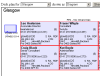

# deskplans
XSLT / SVG office desk plans and other visualisations

These are generated from an XML file containing basic office layout and user / desk / computer location data. Data are drawn from Active Directory and Spiceworks to display details, photographs and so on. Hyperlinks are also added to allow easy access to various functions (remote control, phone calls etc)

